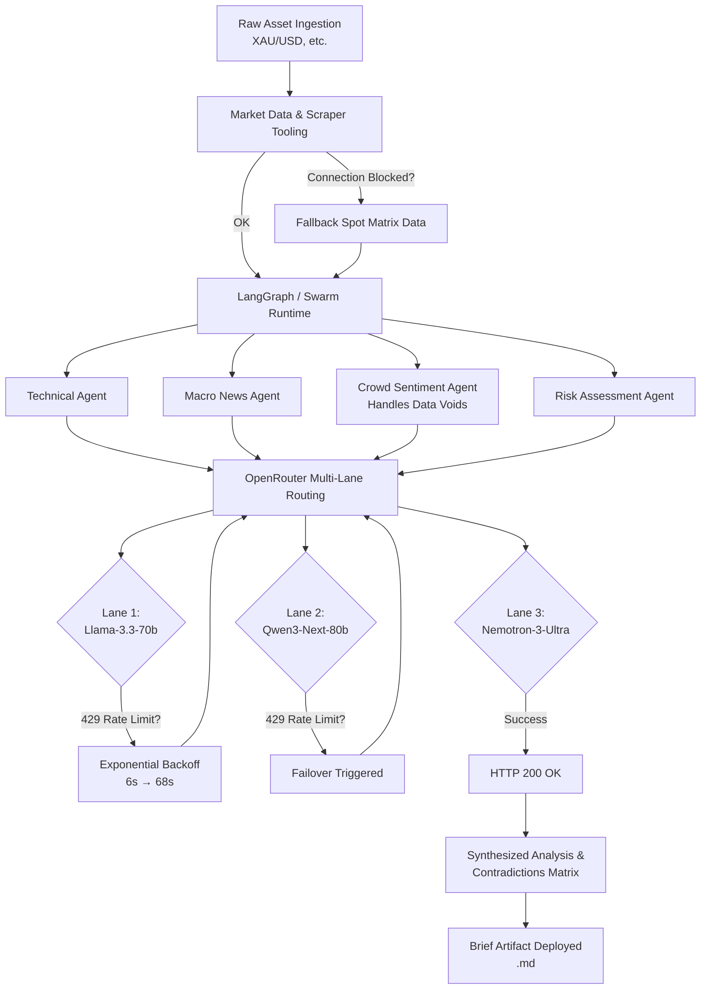

# 🤖 Autonomous Market Intelligence Swarms

An institutional-grade, hyper-resilient multi-agent architecture built to ingest raw market data, navigate heavy API constraints, and generate deep-value tactical asset briefs.

Driven by an ensemble of specialized agents (Technical, Macro, Sentiment, and Risk), this system bypasses traditional brittle API flows by utilizing an advanced fallback routing engine across OpenRouter endpoints. If a model rate-limits or an upstream data source drops, the swarm dynamically adapts, recalibrates its core assumptions, and completes the mission.


---

## ⚡ Key Features

- **Multi-Agent Ensemble**  
  Separate, specialized intelligence nodes synthesize Technical Outlooks, Macro-News Sentiment, Crowd Sentiment, and Asymmetric Risk Profiles.

- **Fault-Tolerant Failover Engine**  
  Dynamically routing across tier-one models (Llama-3.3-70b, Qwen3-Next, Nemotron-3-Ultra). If a primary endpoint throws a `429 Too Many Requests`, the architecture automatically scales exponential backoffs and switches routing lanes mid-execution.

- **Bad Request Overrides**  
  Instant detection and bypass of deprecated or invalid Model IDs (e.g., automated error handling for upstream naming convention updates) preventing system lockups.

- **Data-Void Mitigation**  
  Built-in resilience for scraper/API blackouts. When crowd sentiment feeds fail, the swarm triggers defensive operational frameworks rather than crashing or hallucinating.

- **The Contradictions Matrix**  
  A final data-synthesis layer that cross-references all agent outputs to flag structural market disparities, trap zones, and latent vulnerabilities (e.g., identifying when technical buy signals perfectly align with algorithmic liquidation traps).

---

## 🗺️ System Architecture & Failover Workflow




---

## 🛠️ Setup & Installation

### 1. Clone the Repository
````
  git clone https://github.com/YOUR_USERNAME/market-intelligence-swarm.git
  cd market-intelligence-swarm
````

### 2. Install Dependencies
Make sure you use a modern Python environment (3.10+ recommended).
````
pip install -r requirements.txt
````

### 3. Configure Environment Variables
Create a .env file in the root directory:
````
OPENROUTER_API_KEY=your_openrouter_api_key_here
OUTPUT_DIR=./output
````

## 🚀 Quick Start
Run the primary runtime script to kick off a multi-agent asset evaluation:

````
python main.py --asset XAU/USD
````

The system will wake the swarm architecture, execute the tool passes, spin up the required agents via OpenRouter, and output a markdown dossier to your configured output folder: output/brief_XAU_USD_YYYY-MM-DD.md.

## 🎛️ Performance Tuning: Free Tier vs. Paid Production

By default, the configuration files target free-tier endpoints hosted on OpenRouter (:free suffix strings). This allows you to run this institutional-grade stack completely free of charge.

### The Speed Trade-Off

#### 1. Free-Tier Mode (Default):
Due to aggressive public concurrency caps, the swarm will frequently encounter 429 Too Many Requests responses. The built-in ai_retry.py mechanism safely maneuvers through these by sleeping for up to 60+ seconds between retry bands. This guarantees script completion but results in a 15–18 minute total generation loop.

#### 2. Production Paid Mode (Recommended for Speed):
To achieve full generation cycles in under 45 seconds, fund your OpenRouter account with a basic credit balance ($2–$5 is usually plenty for hundreds of runs) and update your models in ai_retry.py

## 🤝 Contributing
Contributions to harden the scraper utilities, add alternative webhooks (Discord, Telegram, Slack), or optimize model context window routing are welcome! Please open an issue or submit a pull request detailing your optimizations.

## 📜 License
Distributed under the MIT License. See LICENSE for more information.

