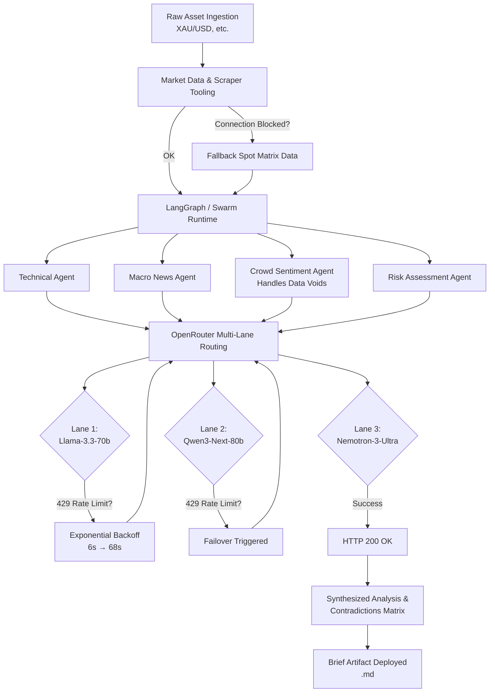

# 🤖 Autonomous Market Intelligence Swarms

An institutional-grade, hyper-resilient multi-agent architecture built to ingest raw market data, navigate heavy API constraints, and generate deep-value tactical asset briefs.

Driven by an ensemble of specialized agents (Technical, Macro, Sentiment, and Risk), this system bypasses traditional brittle API flows by utilizing an advanced fallback routing engine across OpenRouter endpoints. If a model rate-limits or an upstream data source drops, the swarm dynamically adapts, recalibrates its core assumptions, and completes the mission.


---

## ⚡ Key Features

- **Multi-Agent Ensemble**  
  Separate, specialized intelligence nodes synthesize Technical Outlooks, Macro-News Sentiment, Crowd Sentiment, and Asymmetric Risk Profiles.

- **Fault-Tolerant Failover Engine**  
  Dynamically routing across tier-one models (Llama-3.3-70b, Qwen3-Next, Nemotron-3-Ultra). If a primary endpoint throws a `429 Too Many Requests`, the architecture automatically scales exponential backoffs and switches routing lanes mid-execution.

- **Bad Request Overrides**  
  Instant detection and bypass of deprecated or invalid Model IDs (e.g., automated error handling for upstream naming convention updates) preventing system lockups.

- **Data-Void Mitigation**  
  Built-in resilience for scraper/API blackouts. When crowd sentiment feeds fail, the swarm triggers defensive operational frameworks rather than crashing or hallucinating.

- **The Contradictions Matrix**  
  A final data-synthesis layer that cross-references all agent outputs to flag structural market disparities, trap zones, and latent vulnerabilities (e.g., identifying when technical buy signals perfectly align with algorithmic liquidation traps).

---

## 🗺️ System Architecture & Failover Workflow




---

## 🛠️ Setup & Installation

### 1. Clone the Repository
````
  git clone https://github.com/YOUR_USERNAME/market-intelligence-swarm.git
  cd market-intelligence-swarm
````

### 2. Install Dependencies
Make sure you use a modern Python environment (3.10+ recommended).
````
pip install -r requirements.txt
````

### 3. Configure Environment Variables
Create a .env file in the root directory:
````
OPENROUTER_API_KEY=your_openrouter_api_key_here
OUTPUT_DIR=./output
````

## 🚀 Quick Start
Run the primary runtime script to kick off a multi-agent asset evaluation:

````
python main.py --asset XAU/USD
````

The system will wake the swarm architecture, execute the tool passes, spin up the required agents via OpenRouter, and output a markdown dossier to your configured output folder: output/brief_XAU_USD_YYYY-MM-DD.md.

## 🎛️ Performance Tuning: Free Tier vs. Paid Production

By default, the configuration files target free-tier endpoints hosted on OpenRouter (:free suffix strings). This allows you to run this institutional-grade stack completely free of charge.

### The Speed Trade-Off

#### 1. Free-Tier Mode (Default):
Due to aggressive public concurrency caps, the swarm will frequently encounter 429 Too Many Requests responses. The built-in ai_retry.py mechanism safely maneuvers through these by sleeping for up to 60+ seconds between retry bands. This guarantees script completion but results in a 15–18 minute total generation loop.

#### 2. Production Paid Mode (Recommended for Speed):
To achieve full generation cycles in under 45 seconds, fund your OpenRouter account with a basic credit balance ($2–$5 is usually plenty for hundreds of runs) and update your models in ai_retry.py

## 🤝 Contributing
Contributions to harden the scraper utilities, add alternative webhooks (Discord, Telegram, Slack), or optimize model context window routing are welcome! Please open an issue or submit a pull request detailing your optimizations.

## 📜 License
Distributed under the MIT License. See LICENSE for more information.


## 📝 Sample Output 
=== SYSTEM OUTPUT TERMINAL PREVIEW ===
# Autonomous Intelligence Brief: XAU/USD
## Executive Summary
**Asset:** XAU/USD (Gold) | **Cycle:** 2026-06-06 to 2026-06-10 | **Classification:** **TACTICAL LONG / STRATEGIC DEFENSIVE**  
**Core Thesis:** Gold is exhibiting a classic "Bearish Structure, Bullish Momentum" divergence. Price action has stabilized above a critical demand zone ($2,218) with a confirmed MACD bullish crossover and RSI momentum recovery (55.7). However, the macro backdrop is fragile: the rally is driven by geopolitical safe-haven flows *and* a dovish Fed pricing assumption that is highly vulnerable to the June 12 CPI/FOMC event window. The Risk Swarm identifies the consensus "Hard Stop" at $2,218.94 as a high-probability liquidation magnet. **Verdict:** Long exposure is viable *only* with options-defined risk or stops placed below structural option gamma walls ($2,200), not technical swing lows. Do not chase the $2,248 resistance breakout; fade failed tests.

---

## Technical Outlook
**Trend State:** Medium-Term Bearish (Price < SMA_50/200) | **Momentum State:** Short-Term Bullish (MACD Cross, RSI Rising)  
**Key Levels:**
*   **Immediate Resistance:** **$2,247.69** (Double Top / Liquidity Trap). Two failed tests (Jun 9, 10). Breakout requires volume surge; absent that, expect rejection.
*   **Equilibrium Pivot:** **$2,235.34** (Current Close). Fair value zone for re-entry on pullbacks.
*   **Tactical Support (Consensus):** **$2,218.94** (Swing Low). **HIGH RISK:** Algo stop-cluster target.
*   **Structural Support (Risk Swarm):** **$2,200** (Major Put Strike OI / Round Number / Negative Gamma Wall). True "Line in the Sand."
*   **Upside Target (If Breakout Confirmed):** **$2,277.35** (SMA_50). Confluence of trend resistance.

**Indicator Composite:**
*   **MACD (-12.33 / Signal -17.11):** Confirmed Bullish Crossover. Momentum shifting from distribution to accumulation.
*   **RSI (55.73):** Neutral-Bullish. Room to run before overbought (>70). No bearish divergence yet.
*   **Moving Averages:** Price remains capped by declining SMA_50 ($2,277) and SMA_200 ($2,296). **Rallies are corrective until SMA_50 is reclaimed.**


---

## News & Sentiment Overview
**Macro-News Sentiment: MODERATELY BULLISH (+0.2 Net)**
*   **Bullish Driver (+0.6):** Geopolitical tension escalation driving safe-haven bid. "Monetary policy under review" narrative supports dovish pivot hopes.
*   **Bearish Drag (-0.2):** Technical consolidation narrative; resistance holding firm ahead of Central Bank asset announcements. Volume drying up at highs.

**Crowd Sentiment (Retail/Social): DATA VOID — FRAMEWORK ACTIVE**
*   *Status:* Real-time social feeds (X, Reddit, StockTwits, Order Flow) currently offline/empty.
*   *Implication:* **Blind Spot.** Cannot verify FOMO vs. Paper Hands dynamics. Cannot compute Institutional vs. Retail Discrepancy Ratio (DR).
*   *Operational Assumption:* Absence of retail FOMO noise during a bounce off support ($2,218) suggests **institutional bid / algorithmic accumulation** rather than retail chase. This is constructive for the long bias *if* confirmed by block volume data.

---

## Risk Assessment
**Risk Officer Verdict: CONSENSUS IS FRAGILE. ASYMMETRIC DOWNSIDE DOMINATES.**

### 1. Liquidity & Liquidation Maps
| Zone | Level | Threat Vector | Probability |
| :--- | :--- | :--- | :--- |
| **Primary Stop Hunt** | **$2,215 – $2,218** | Consensus "Hard Stop" cluster ($2,218.94). HFT/CTA algos target visible swing low liquidity. Asian session low-liquidity wick risk. | **HIGH** |
| **Gamma Trap / Structural Floor** | **$2,200** | Heavy Put OI (Dec '26). Dealer negative gamma hedging forces spot selling on break. Magnetic anchor. | **MEDIUM / EXTREME SEVERITY** |
| **Failed Breakout Trap** | **$2,248 – $2,255** | Double Top resistance + weak-handed momentum chasers. Failed break triggers fast unwind to $2,230. | **HIGH** |
| **Systemic Air Pocket** | **$2,180 – $2,190** | Margin call waterfall (Leveraged ETFs/Futures) + 200-week SMA. Requires exogenous shock (CPI/Fed). | **LOW / EXISTENTIAL** |

### 2. Macro Correlation Vulnerabilities (The "Poke Holes")
*   **Real Rate Trap (Primary):** XAU correlates **-0.85 to US 10yr Real Yields (TIPS)**. Current Real Yield ~2.15%. Market prices *zero* hawkish surprise risk.
    *   *Trigger:* Jun 12 CPI Core > 3.4% OR Dot Plot Median > 5.125%.
    *   *Impact:* Real Yields -> 2.35%+. **Instant -$40/-$60 move.** T-Bills (5.3%) become superior safe haven. Gold's "War Bid" evaporates as Opportunity Cost spikes.
*   **Dollar Smile Regime Shift:** 30-day Rolling Corr (XAU, DXY) = **+0.45**. Gold rising *with* USD (US Exceptionalism regime).
    *   *Trap:* Geopolitics drives capital into USD/Treasuries, *not* Gold. If risk-off intensifies -> DXY Rips + Yields Rise = **Double Hit on Gold**.
*   **Central Bank "Asset Announcement" Risk:** PBOC/Official sector buying opacity. Any signal of purchase pause removes the only fundamental bid independent of rates.

---

## Contradictions Matrix
*Cross-referencing Technical, News, Crowd, and Risk streams to expose structural disparities.*

| Vector | Technical Signal | News / Macro Signal | Crowd Signal | Risk Swarm Signal | **Disparity / Latent Vulnerability** |
| :--- | :--- | :--- | :--- | :--- | :--- |
| **Trend Direction** | **Bearish Structure** (Price < SMA_50/200) | **Bullish Narrative** (Safe Haven / Pivot Hope) | **Unknown** (Data Void) | **Bearish Structure** (Resistance clusters, Gamma walls) | **CRITICAL:** Technicals & Risk align Bearish; News is Bullish. The "Pivot Hope" is the *only* pillar supporting price. If CPI/FOMC dashes hope, structure has no support until $2,200. |
| **Support Validity** | **$2,218.94 = Valid Floor** (Swing Low, Rebound) | **Irrelevant** (Fundamentals don't respect TA levels) | **Unknown** | **$2,218.94 = Liquidation Magnet** (Consensus Stop Cluster) | **HIGH CONVICTION CONTRADICTION:** The Technical "Buy Signal" (bounce off support) *is* the Risk "Sell Signal" (stop hunt target). **Entry at current levels ($2,235) chasing the bounce enters the kill zone.** |
| **Momentum vs. Macro** | **Bullish Momentum** (MACD Cross, RSI 55) | **Fragile Foundation** (Real Yields restrictive, DXY Positive Corr) | **Unknown** | **Asymmetric Downside** (Real Rate Shock = -$60) | **LATENT VULNERABILITY:** Momentum is a *lagging* reflection of past flow. Macro vulnerability (Real Rates) is a *leading* driver of future flow. The MACD cross confirms the *relief rally*, not the *trend reversal*. |
| **Resistance Breakout** | **$2,248 Break -> $2,277 (SMA_50)** | **Central Bank Announcements Pending** (Volatility Catalyst) | **Unknown** | **$2,248 = Failed Break Trap** (Weak hands, Gamma resistance) | **SYNCHRONIZED RISK:** Technical Target (SMA_50) aligns with Risk Resistance. News Catalyst (CB Announce) provides the *volatility* to trigger the fakeout. **Do not buy the break.** |

### **Synthesized Latent Vulnerability: "The Dovish Pivot Mirage"**
The market is pricing a **Goldilocks scenario**: Geopolitics bid the floor + Fed Pivot bids the ceiling. The Technical bounce ($2,218 -> $2,235) and MACD cross are artifacts of this specific pricing.
**The Singular Point of Failure:** **June 12 CPI/FOMC.**
*   **If Data = Soft:** Pivot validated. SMA_50 ($2,277) attacked. Technicals align with Macro. Long works.
*   **If Data = Sticky/Hawkish:** Pivot mirage shattered. Real Yields spike. DXY rips. Technical Support ($2,218) hunted -> Gamma Wall ($2,200) breached -> Air Pocket ($2,180).
*   **Current Positioning:** Market is Long Gamma / Short Real Rates. **Max Pain is Down.**

---

**Generated autonomously by AI Market Intelligence Swarm**
======================================

INFO:SwarmRuntime:Brief artifact deployment successful: output/brief_XAU_USD_2026-06-10.md
